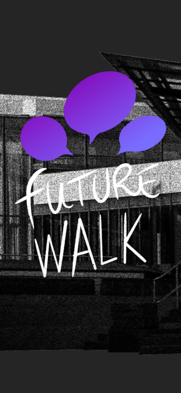
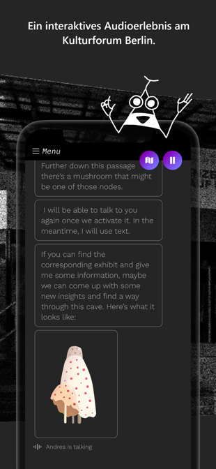
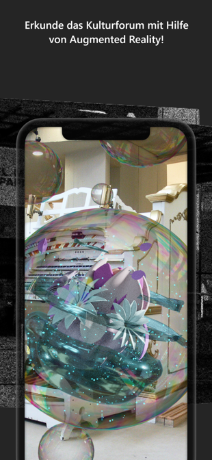
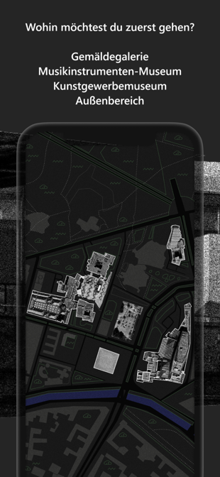
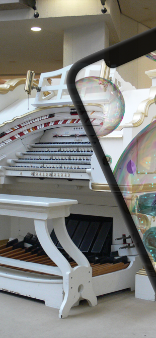

# Future Walk: An interactive listening experience for the Kulturforum and its museums

   
 


# Table of Contents

1. [Summary](#Summary)
2. [Introdcuction](#Introduction)
3. [Technical Documentation of the Programming](#Technical-Documentation-of-the-Programming)
4. [Unity Project / Working with stories](#Unity-Project-/-Working-with-stories)
5. [Folderstructure](folderstructure.md)
6. [Story Variables - Tags - Story Macros](scripting.md)
7. [Credits](#Credits)
8. [License](#License)

# Summary

The application __Future Walk__ is a native app for an interactive information offer on the exhibitions at the Kulturforum and its museums in Berlin. The app is designed as an interactive audioguide with AR moments. A science-fiction story guides the users through 3 museums and the surroundings of the Kulturforum and ask the visitors to help a museum curator from the future through AR interactions. The story is related to the Kulturforum and aims to educate about the history of the place and its museums as well as the exhibitions inside.

Future Walk opens new ways of interaction and engagement for visitors and reinforces the immersion at the exhibition space.

This iOS/Android Unity project is part of the project museum4punkt0 - Digital Strategies for the Museum of the Future, sub-project "(De-)Coding Culture. Cultural Competence in Digital Space" of the Staatliche Museen zu Berlin. Further information: [www.museum4punkt0.de/](https://www.museum4punkt0.de/).

The project museum4punkt0 is funded by the Federal Government Commissioner for Culture and the Media in accordance with a resolution issued by the German Bundestag (Parliament of the Federal Republic of Germany).


# Introduction

This Documentation should give an overview to get started using the source-code provided in this repository for your own purpose. The project was built to be recycled and uses the interactive storytelling tool *Twine* to build the story and it's branching logic. For a start try to modify the example-project.


### Description


__Future Walk__ was built using Unity (version 2019.4.4f1). Unity is a proprietary software to build games, interactive installations and mobile applications and offers tools for modelling, animation and interaction and allows to create AR experiences on mobile platforms. Unity can be used for free for non-commercial projects and was used because of its versatility and tools specifically targeted for AR.

Used Software, technologies and packages:

* Unity (2019.4.4f1)
* Unity XR

Unity packages:

* Cradle - MIT
* JSONObject - copyrighted, but open
* Native Toolkit - MIT
* Unity-GeoJSONObject - MIT
* Unity Toolbag - MIT
* Fingers Lite - Unity's standard Unity Asset Store End User License Agreement, free
* Tween (Digitalruby) - MIT

Additional libraries:

* KontaktIO bluetooth
* GeoTools GPS

This manual provides an explanation on how to set up the tool and how to change the content in order to be adapted for other scenarios.
 

# Technical Documentation of the Programming

This document offers technical details on this repository and act as an intro guide to the code. It is aimed at anyone trying to understand what the code is doing. The app will compile but will only show the content of an example project unless the content of the project is changed.

## General Structure and Remarks

### Unity Project Architecture & Scripts Paradigms

Most of the Controllers are implemented as Singletons so they are easy to access in other parts of the project. Make sure to only keep one instance of these classes.

Singleton Controllers

* ARSceneController
* ArtworkInfoController
* AudioController
* BeaconController
* BurgerMenuController
* ChoiceButtonMover
* GeoJsonController
* GlobalSettings
* GpsController
* MainPageController
* NotificationManager
* StoryChat
* StoryController

This project uses addressables.  
**Make sure to build the addressable catalogue before building for your device!**


#### Story Controller. Twine and Cradle.

This app uses Cradle to import and playback story scripts created in Twine using the story-scripting language *Harlowe-2*. Twine scripts are converted into C#-classes by Cradle automatically everytime the script changes or if requested manually.

[https://twinery.org/](https://twinery.org/){:target="_blank"}<br>
[https://twine2.neocities.org/2.html](https://twine2.neocities.org/2.html){:target="_blank"}<br>
[https://github.com/daterre/Cradle](https://github.com/daterre/Cradle){:target="_blank"}

The class `StoryController` is the main controller to deal with the story-classes created by Cradle. It scans for available storyscript classes, initiates lading stories and maintains the GameState (the history).

The class `StoryChat` implements `IStoryVisualizer` and `IStoryPlayerListener` and is responsible to render the correct visual item on screen.

The class `StoryPlayer` subclasses `ThreadedDelayRunner`, implements `IStoryPlayer` and is responsible to handle the messages coming from the actual story. It runs on it's own thread to ensure the story continues if the screen is off and other Unity-tasks gets stopped.

Cradle allows custom macros to be called from the story-script. `StoryMacros` is the class extending the default functionality of Harlowe. For further information please have a look at [Scripting](scripting.md)


#### Global Settings

In the class `GlobalSettings` general strings are defined used in the app, it also manages the loading and storing of application settings like: language-choice, accessibility on/off, completed story-arcs and other necessary persistent settings.


#### Adressables

This project uses addressables.  
**Make sure to build the addressable catalogue before building for your device!**

[https://learn.unity.com/project/getting-started-with-addressables](https://learn.unity.com/project/getting-started-with-addressables){:target="_blank"}<br>
[https://docs.unity3d.com/Packages/com.unity.addressables@1.8/manual/index.html](https://docs.unity3d.com/Packages/com.unity.addressables@1.8/manual/index.html){:target="_blank"}<br>
[https://thegamedev.guru/unity-addressables/tutorial-learn-the-basics/](https://thegamedev.guru/unity-addressables/tutorial-learn-the-basics/){:target="_blank"}

In the process of developing the internal Resources in the folder `Resources` were moved to the addressable system and its default folder `Resources_moved`.

All the story-scripts in the form of html files and their C# counterparts are located in `Resources/project/`. Also the synthesizer presets need to be located in `Resources/project/` as the loading of presets does not support using addressables. All files in Resources are compiled into the app and are shipped with it.

All additional assets like sound and images are located in `Resources_moved/project/` and are loaded and managed using the addressable system by Unity. These files may get loaded from a server after the app was installed and started the first time.


#### Audio Controller

The class `AudioController` loads, plays and stops audio and manages the granular synthesizer. 

##### Synthesizers

This project features a granular synthesizer for the background music. The code for the synthsizer can be found in the subfolder "Synth" and was developed as a standalone module. The synthesize loads preset files in json format. Please have a look at [Scripting](scripting.md) to see how to load presets in twine.


##### Notifications

The class `NotificationController` handles multiple `AudioNotificationPlayer` and allows to start playing back a preloaded audio notification. `AudioNotificationPlayer` provides slots for two languages and 4 samplerates: 24kHz, 32kHz, 44.1kHz, 48kHz.
It also calls `NativeToolkit.Vibrate()` for "ping" notifications, which lets the device vibrate if possible (see comments in souce file).

##### Background mode and threading

To maintain execution of the story logic even if the app is in background mode (e.g. the screen is turned off) the story runs on its own thread. This is problematic as Unity is not thread safe and calls to it may fail. Due to this restriction the loading of files (e.g. audio) can only be done when the app is in foreground and has the focus. The __Future Walk__ is therefore made in a way that the user is prompted everytime a new audio file needs to be loaded.


##### UI Frame

The UI is built using the default UI framework of Unity. Some extra scipts are used to animate the pages e.g.: the burger menu.

##### AR Scene: XRFoundation, ARCore & ARKit

This app uses ARKit on iOS and ARCore on android provided by Unity's XR framework. The XR component is dynamically created whenever it is necessary by `ARSceneController`. 

To provide a more seamless experience the class `ARController` is used to blank out the screen before the first image from the camera arrives.

## Compiling to Devices

Make sure GameObject "StoryController" has "Force Story Name" turned off. This flag controls if the story starts with the last saved story or the first one found. If it is turned off it loads the story stored in the app settings hence starting at the last loaded story.

### Compiling to Android

- needs gradle 5.6.4 or later
	[https://gradle.org/releases/](https://gradle.org/releases/){:target="_blank"}
	[https://developers.google.com/ar/develop/unity/android-11-build](https://developers.google.com/ar/develop/unity/android-11-build){:target="_blank"}

On Android the unityplayer needs to keep running even if the app is not in the foreground, otherwise audio stops working. To achieve this you need to adjust the file: `UnityPlayerActivity.java`<br>

You find this file in the Unity Playback Engine for Android:

**macos:**
`/Applications/Unity/Hub/Editor/2019.4.4f1/PlaybackEngines/AndroidPlayer/Source/com/unity3d/player/UnityPlayerActivity.java`

**windows:**
`C:\Program Files\Unity\Hub\Editor\2019.4.4f1\Editor\Data\PlaybackEngines\AndroidPlayer\Source\com\unity3d\player\UnityPlayerActivity.java`

(On Windows you may need to be administrator to change this file)


You need to introducde this line to the class "UnityPlayerActivity":

`protected boolean pausePlayerOnPause = true;`

so the first lines of the class look like this:

	public class UnityPlayerActivity extends Activity implements IUnityPlayerLifecycleEvents
	{
	    protected boolean pausePlayerOnPause = true;
	    protected UnityPlayer mUnityPlayer; // don't change the name of this variable; referenced from native code


Further down in the same class you need to change the function `onPause()` so it looks like this:


    @Override protected void onPause()
    {
        super.onPause();
        if (pausePlayerOnPause)
        {
            mUnityPlayer.pause();
        }
    }


### Signing for Android:

The project is set to use a keystore that does not ship with this repository. If you want to build an app that can be used to update on the Google Play Store, you will need this keystore. It currently is in 02_project/02_dev/21_Signing
You need this file and the password, and in Player Settings -> Android Tab -> Publishing Settings, activate Custom Keystore, select the keystore and provide the password for the keystore and the key.


# Unity Project / Working with stories

The main scene for __Future Walk__ is called `MainGame`. When opening the project the first time, please open `MainGame` from the `Scenes` folder.

The app provides an onboarding process with initial language selection. Translations are done by taged GameObjects - Please look into the project for further details.

Additional Files

##### artworks.json

This file contains information about artworks in english and german and can be used with the tag `<Artwork src="artwork-id"/>`

##### map.geojson.json

This file contains gps fences for the story and was created with: [http://geojson.io/#map=18/52.50845/13.36709](http://geojson.io/#map=18/52.50845/13.36709){:target="_blank"}.
Please make sure to save the file as `GeoJSON` from the Save-Menu and rename it to `map.geojson.json `.
To use geojson items in the story they need to have a property called `id`. Please use this id together with e.g.: `(waitForFence: "fence-id")`


### Creating a Story:

Please have a look at: [Folderstructure](folderstructure.md)

#### Writing twine scripts

Download Twine for your System here: [https://twinery.org/](https://twinery.org/){:target="_blank"}
You find the example project in `Assets/Resources/project/`. To get started import the html files into Twine using `Import From File`.


#### Tag "Bot"

If a Passage is tagged as "Bot" it appears as a bot-bubble (Motoko) in the chat interface. Any Passage not tagged "Bot" is showing up as a chat-bubble by Andrea. Playing back audio also activates an indication who is talking: "Motoko" or "Andrea".

#### Translation

The project is setup to deal with english and german. Language translation is done in the story-scripts using the variable `isenglish`:

```
(if: $isenglish)[

english text

](else:)[

deutscher text

]
```

#### Playing Audio with transcripts

Playing audio is possible by abusing the `<a>` tag. Please see the example story and [Scripting](scripting.md) for more details.


#### Adding Story Assets

Story assets are located at `Assets/Resources_moved/project` and have to be activated as `Addressable` in Unity. To mamange addressables please open the addressables group window: Window -> Asset Management -> Addressables -> Groups.
Please look at the Project for more details.


# Credits

Contracting entity: Staatliche Museen zu Berlin - Preußischer Kulturbesitz

Authorship: Staatliche Museen zu Berlin - Preußischer Kulturbesitz / NEEEU Spaces GmbH

This manual has been developed by museum4punkt0 and NEEEU Spaces GmbH in the context of the Future Walk project within museum4punkt0, sub-project "(De-)Coding Culture. Cultural Competence in Digital Space" of the Staatliche Museen zu Berlin.

Contact Information for Project Responsibles

museum4punkt0 / Staatliche Museen zu Berlin – Preußischer Kulturbesitz: Sandro Schwarz: s.schwarz@smb.spk-berlin.de

NEEEU Spaces GmbH  – Javier Soto Morrás: j@neu.io - hello@neu.io


# License

This repository contains the open source parts of the museum4punkt0 Future Walk project for the Kulturforum Berlin. In order to run this project, you need to add the closed-source third-party library:

[https://assetstore.unity.com/packages/tools/input-management/fingers-lite-free-finger-touch-gestures-for-unity-64276](https://assetstore.unity.com/packages/tools/input-management/fingers-lite-free-finger-touch-gestures-for-unity-64276){:target="_blank"}

as instructed in the text file in that folder.
All other third party libraries contain their own permissive open source licences.


MIT License
Copyright © 2020, Staatliche Museen zu Berlin - Preußischer Kulturbesitz / NEEEU Spaces GmbH

Permission is hereby granted, free of charge, to any person obtaining a copy of this software and associated documentation files (the 'Software'), to deal in the Software without restriction, including without limitation the rights to use, copy, modify, merge, publish, distribute, sublicense, and/or sell copies of the Software, and to permit persons to whom the Software is furnished to do so, subject to the following conditions:

The above copyright notice and this permission notice shall be included in all copies or substantial portions of the Software.

THE SOFTWARE IS PROVIDED "AS IS", WITHOUT WARRANTY OF ANY KIND, EXPRESS OR IMPLIED, INCLUDING BUT NOT LIMITED TO THE WARRANTIES OF ERCHANTABILITY, FITNESS FOR A PARTICULAR PURPOSE AND NONINFRINGEMENT. IN NO EVENT SHALL THE AUTHORS OR COPYRIGHT HOLDERS BE LIABLE FOR ANY CLAIM, DAMAGES OR OTHER LIABILITY, WHETHER IN AN ACTION OF CONTRACT, TORT OR OTHERWISE, ARISING FROM, OUT OF OR IN CONNECTION WITH THE SOFTWARE OR THE USE OR OTHER DEALINGS IN THE SOFTWARE.

